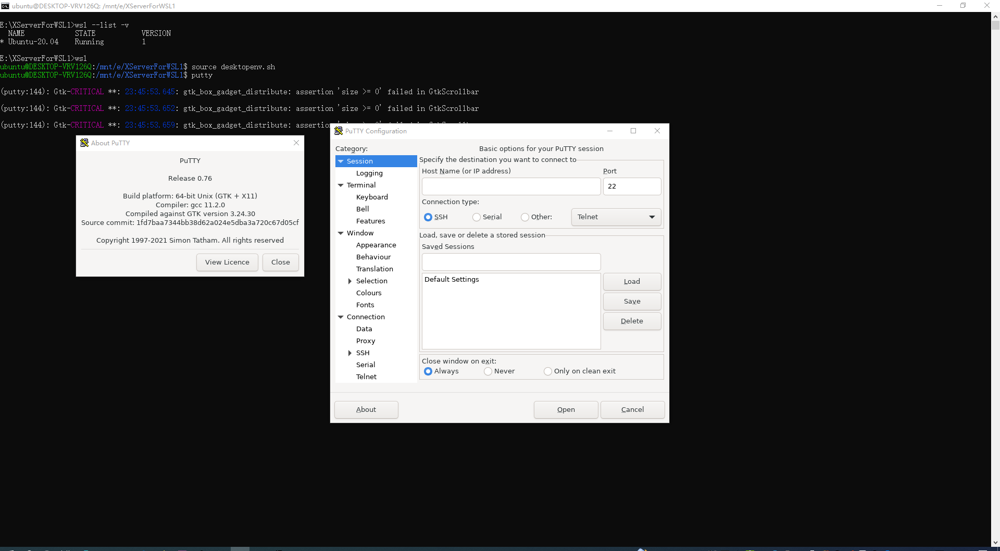
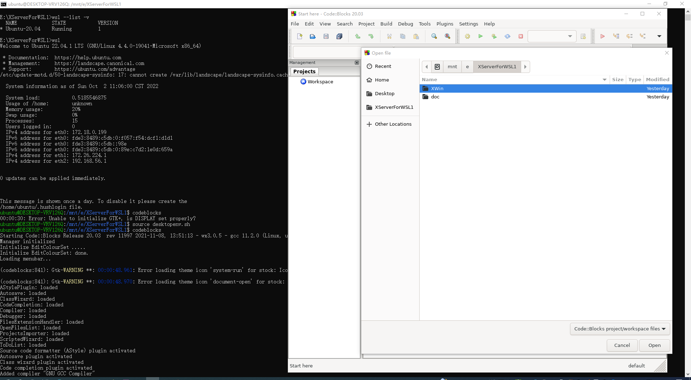

# 说明

利用[cygwin](http://cygwin.org/)的Xorg为WSL1中的桌面程序提供X服务。

可在WSL1中运行桌面程序。

特点如下:

- 无需在WSL中运行X服务。
- 利用TCP端口（6000）提供服务,故需要注意公网暴露的问题。

# 使用

## 启动X服务

进入 [XWin](XWin) 目录后，双击运行XWin.bat即可。

当X服务正在运行时,任务栏托盘中会有以下图标:


当X服务意外关闭后(即任务栏图标消失),需要重新运行XWin.bat。

## 启动WSL桌面程序

注意:WSL桌面程序运行过程中，必须确保X服务处于运行状态。

进入当前目录，输入以下命令即可设置好桌面环境运行环境:

```bash
source desktopenv.sh
```

注意:WSL桌面程序的各种问题如中文字体等均需要在WSL中解决。

# 截图





# 相关链接

- [https://x.cygwin.com/](https://x.cygwin.com/)