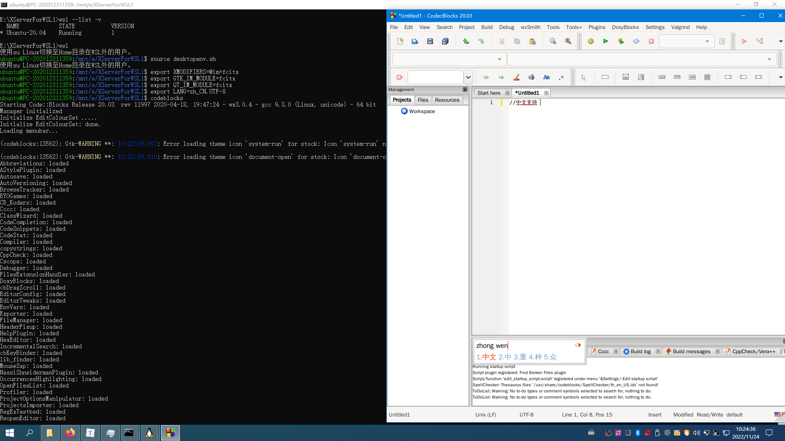

# 说明

利用[cygwin](http://cygwin.org/)的Xorg为WSL1中的桌面程序提供X服务。

可在WSL1中运行桌面程序。

特点如下:

- 无需在WSL中运行X服务。
- 利用TCP端口（6000）提供服务,故需要注意公网暴露的问题。

# 使用

## 启动X服务

进入 [XWin](XWin) 目录后，双击运行XWin.bat即可。

当X服务正在运行时,任务栏托盘中会有以下图标:


当X服务意外关闭后(即任务栏图标消失),需要重新运行XWin.bat。

## 启动WSL桌面程序

注意:WSL桌面程序运行过程中，必须确保X服务处于运行状态。

进入当前目录，输入以下命令即可设置好桌面环境运行环境:

```bash
source desktopenv.sh
```

注意:WSL桌面程序的各种问题如中文字体等均需要在WSL中解决。

## 中文环境

对于ubuntu 20.04系统,设置中文环境需要执行以下步骤：

1. 设置locales
2. 安装中文字体与支持中文的输入法
3. 启动支持中文的输入法
4. 设置输入法环境变量

### 设置locales

使用以下命令配置locales:

```bash
sudo dpkg-reconfigure locales
```

配置locales过程中，需要选中zh_CN.UTF-8。此配置只需要进行一次。

### 安装中文字体与支持中文的输入法

使用以下命令安装中文字体(wqy)与支持中文的输入法(fcitx):

```bash
sudo apt-get install fonts-wqy-microhei fonts-wqy-zenhei fcitx-sunpinyin
```

### 启动支持中文的输入法

启动支持中文的输入法前需要设置好桌面环境，X服务只允许运行一个fcitx:

```bash
#进入桌面环境
source desktopenv.sh
#启动fcitx
fcitx-autostart

#启动完成后，fcitx将在后台运行，此时可关闭当前终端
```

注意:每个X服务只需要执行一次启动操作。除非X服务退出，无需重复执行。

### 设置输入法环境变量

注意:此操作对于每个终端都应执行一次。

使用以下命令设置输入法环境变量,设置好后即可打开桌面程序:

```bash
#进入桌面环境
source desktopenv.sh
#设置输入法环境变量
export XMODIFIERS=@im=fcitx 
export GTK_IM_MODULE=fcitx
export QT_IM_MODULE=fcitx
#设置语言环境
export LANG=zh_CN.UTF-8

#此时再启动桌面程序即可使用输入法

```

需要中文输入时，使用默认热键ctrl+space即可切换到中文输入，使用fcitx-config-gtk3可配置输入法。

# 截图




# 相关链接

- [https://x.cygwin.com/](https://x.cygwin.com/)